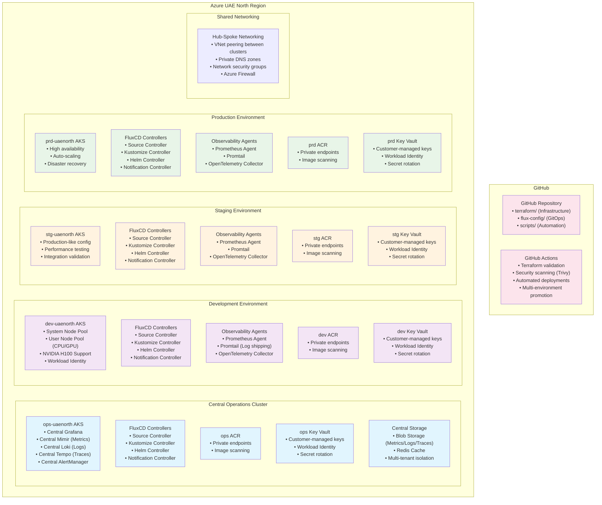

# Platform Core

Platform Core is a comprehensive infrastructure-as-code solution for deploying and managing enterprise-grade Kubernetes platforms on Azure. It provides a secure, scalable, and maintainable foundation for running containerized applications with built-in support for both CPU and GPU workloads, featuring centralized multi-cluster observability and UAE sovereign cloud compliance.

## Purpose

This project aims to:

1. **Standardize Infrastructure**: Provide a consistent, repeatable infrastructure setup across development, staging, and production environments.

2. **Enhance Security**: Implement security best practices including:
   - Customer-managed key encryption for all resources
   - Private networking with service endpoints
   - Azure Key Vault integration with Workload Identity
   - RBAC and network policies
   - UAE sovereign cloud compliance

3. **Support Modern Workloads**: Enable both traditional and AI/ML workloads with:
   - AKS cluster with system and user node pools
   - GPU node pool support (NVIDIA H100, AMD)
   - Azure Container Registry with geo-replication
   - Centralized multi-cluster observability

4. **Simplify Operations**: Reduce operational complexity through:
   - Infrastructure as Code using Terraform
   - GitOps with FluxCD and Kustomize
   - Modular, reusable components
   - Comprehensive documentation
   - Automated deployment processes

## 10-Point Project Summary

### Key Architectural Principles
• **Infrastructure as Code First**: Complete automation using Terraform for Azure resources, FluxCD for GitOps, and GitHub Actions for CI/CD with zero manual configuration steps

• **Environment Isolation**: Each environment (dev, stg, prd, ops) maintains completely separate Azure resources including dedicated AKS clusters, ACRs, and Key Vaults for security and blast radius containment

• **Centralized Observability with Distributed Agents**: Dedicated ops cluster runs central LGTM stack (Loki, Grafana, Tempo, Mimir) while lightweight agents on workload clusters forward metrics, logs, and traces

• **GitOps-Native Operations**: FluxCD controllers running inside each AKS cluster continuously reconcile cluster state with GitHub repository configurations using Kustomize overlays

### Platform Capabilities
• **Multi-Environment Azure AI Platform**: Production-grade infrastructure supporting dev, staging, and production environments in UAE North region with AKS clusters optimized for AI/ML workloads including GPU support

• **Everything-as-Code Philosophy**: Terraform modules for infrastructure, FluxCD with Kustomize for application deployments, and GitHub Actions for validation and promotion across environments

• **GPU-Optimized Kubernetes**: AKS clusters with dedicated GPU node pools (NVIDIA H100, AMD) supporting self-hosted LLMs, RAG systems, and enterprise AI applications with MIG configuration

• **Enterprise Security & Compliance**: Each environment has isolated Azure Key Vault integration, Workload Identity, private endpoints, network policies, and customer-managed encryption keys meeting UAE Cloud Sovereign Policies

• **Cost-Optimized Design**: Resource tagging, spot instances for development, scheduled scaling, and cost monitoring dashboards with environment-based resource sizing and isolation

• **Production-Ready Operations**: Comprehensive monitoring via central ops cluster, alerting, backup strategies, disaster recovery procedures, and automated security scanning with Trivy integration

## Architecture Diagram



This architecture represents a comprehensive, enterprise-grade AI platform built entirely as code, featuring:

**Key Components:**
- **Central Operations Cluster (ops-uaenorth)**: Dedicated cluster for centralized observability with LGTM stack
- **Workload Clusters (dev, stg, prd)**: Environment-specific clusters with observability agents forwarding data to central ops cluster
- **Environment Isolation**: Each environment maintains separate Azure resources (AKS, ACR, Key Vault) for security and blast radius containment
- **GitOps-Native Operations**: FluxCD controllers in each cluster continuously reconcile with GitHub repository
- **Shared Networking**: Hub-spoke VNet topology with private endpoints and network security groups

## Project Structure

```
platform-core/
├── terraform/           # Infrastructure as Code
│   ├── modules/        # Reusable Terraform modules
│   ├── envs/          # Environment configurations
│   └── shared/        # Shared configurations
├── flux-config/        # GitOps configurations
│   ├── bases/         # Common Kustomize bases
│   └── clusters/      # Cluster-specific overlays
├── scripts/            # Helper scripts
└── docs/              # Project documentation
```

## Getting Started

### Prerequisites

1. **Azure Account and Permissions**:
   - Active Azure subscription
   - Owner or Contributor role
   - Azure CLI installed and configured

2. **Development Tools**:
   - Terraform >= 1.0.0
   - Git
   - kubectl
   - Azure CLI
   - FluxCD CLI

3. **Knowledge Requirements**:
   - Basic understanding of Azure services
   - Familiarity with Kubernetes concepts
   - Experience with Terraform
   - Understanding of GitOps principles

### Quick Start - Complete Platform Deployment

This guide walks you through deploying the complete platform across all phases:

#### Phase 1: Core Infrastructure Foundation
**Objective**: Deploy base Azure infrastructure with customer-managed key encryption

```bash
# 1. Clone and setup
git clone https://github.com/your-org/platform-core.git
cd platform-core

# 2. Configure Azure
az login
az account set --subscription <your-subscription-id>

# 3. Setup Terraform backend (shared state storage)
./scripts/setup-terraform-backend.sh

# 4. Deploy development environment
cd terraform/envs/dev-uaenorth
terraform init -backend-config=backend.hcl
terraform workspace new dev
terraform workspace select dev
terraform plan -out=tfplan
terraform apply tfplan

# 5. Deploy operations cluster
cd ../ops-uaenorth
terraform init -backend-config=backend.hcl
terraform workspace new ops
terraform workspace select ops
terraform plan -out=tfplan
terraform apply tfplan
```

**What's Deployed**:
- AKS clusters (dev, ops) with customer-managed key encryption
- Azure Container Registry with private endpoints
- Key Vault with Workload Identity
- Hub-spoke networking with security groups
- Storage accounts for observability data

#### Phase 2: GitOps & Platform Bootstrap
**Objective**: Enable GitOps workflows and deploy core platform services

```bash
# 1. Generate SSH key for FluxCD
ssh-keygen -t ed25519 -C "fluxcd-github@platform-core" -f ~/.ssh/flux_github_deploy_key

# 2. Add public key to GitHub repository as Deploy Key (read-only)

# 3. Bootstrap FluxCD on dev cluster
az aks get-credentials --resource-group rg-aks-dev-uaenorth-001 --name platform-core-dev-aks

flux bootstrap github \
  --owner=YOUR_GITHUB_ORG \
  --repository=YOUR_REPO_NAME \
  --branch=main \
  --path="./clusters/platform-core-dev-aks/flux-system" \
  --private-key-file=~/.ssh/flux_github_deploy_key \
  --personal

# 4. Bootstrap FluxCD on ops cluster
az aks get-credentials --resource-group rg-aks-ops-uaenorth-001 --name platform-core-ops-aks

flux bootstrap github \
  --owner=YOUR_GITHUB_ORG \
  --repository=YOUR_REPO_NAME \
  --branch=main \
  --path="./clusters/platform-core-ops-aks/flux-system" \
  --private-key-file=~/.ssh/flux_github_deploy_key \
  --personal
```

**What's Deployed**:
- FluxCD controllers in each cluster
- NGINX Ingress Controller
- cert-manager for TLS certificates
- External Secrets Operator
- Core platform namespaces

#### Phase 3: Centralized Observability Stack
**Objective**: Deploy centralized LGTM stack with multi-cluster monitoring

```bash
# 1. Verify FluxCD synchronization
flux get kustomizations --all-namespaces

# 2. Check observability components deployment
# On ops cluster:
kubectl get pods -n observability-grafana
kubectl get pods -n observability-mimir
kubectl get pods -n observability-loki
kubectl get pods -n observability-tempo

# On dev cluster:
kubectl get pods -n observability-agent-prometheus
kubectl get pods -n observability-agent-promtail
```

**What's Deployed**:
- Centralized Grafana, Mimir, Loki, Tempo in ops cluster
- Prometheus Agent and Promtail in workload clusters
- Multi-cluster dashboards and alerting
- Cross-cluster data correlation

#### Phase 4: GPU & AI Workload Readiness
**Objective**: Configure GPU support and AI/ML tooling

```bash
# 1. Deploy GPU operators (via FluxCD)
# GPU operators are configured in flux-config/ and will deploy automatically

# 2. Verify GPU node pools
kubectl get nodes --show-labels | grep nvidia.com/gpu

# 3. Test GPU workload deployment
kubectl apply -f examples/gpu-test-job.yaml
```

**What's Deployed**:
- NVIDIA GPU Operator
- GPU node pools with proper labeling
- GPU monitoring dashboards
- Example GPU workloads

#### Phase 5: DevOps CI/CD & Automation
**Objective**: Implement automated CI/CD pipelines

```bash
# 1. Configure GitHub Actions secrets
# Add AZURE_CREDENTIALS, GITHUB_TOKEN, etc. to repository secrets

# 2. Test CI/CD pipeline
# Create a PR with changes to flux-config/ or terraform/
# Verify automated validation and deployment
```

**What's Deployed**:
- GitHub Actions workflows for validation
- Automated security scanning with Trivy
- Terraform plan/apply automation
- Multi-environment promotion workflows

#### Phase 6: AI Stack Enablement
**Objective**: Deploy AI/ML tools and frameworks

```bash
# 1. Deploy AI tools (via FluxCD)
# MLflow, vLLM, Qdrant, etc. are configured in flux-config/

# 2. Verify AI stack deployment
kubectl get pods -n ai-tools
```

**What's Deployed**:
- MLflow for experiment tracking
- vLLM for model serving
- Qdrant for vector storage
- AI/ML monitoring dashboards

### Verification & Testing

```bash
# 1. Verify cluster access
az aks get-credentials --resource-group rg-aks-dev-uaenorth-001 --name platform-core-dev-aks
kubectl get nodes

# 2. Check FluxCD status
flux get kustomizations --all-namespaces
flux get sources git --all-namespaces

# 3. Access Grafana dashboard
# Get the Grafana URL from ops cluster
kubectl get svc -n observability-grafana grafana -o jsonpath='{.status.loadBalancer.ingress[0].ip}'

# 4. Verify observability data flow
# Check that metrics from dev cluster appear in central Grafana
```

### Implementation Guides

For detailed step-by-step instructions:

- **[Phase 1: Core Infrastructure](docs/phase1-howto.md)** - Azure infrastructure deployment
- **[Phase 2: GitOps & Platform Bootstrap](docs/phase2-howto.md)** - FluxCD and core services
- **[Phase 3: Centralized Observability](docs/phase3-howto.md)** - Multi-cluster monitoring
- **[FluxCD Architecture](docs/phase2-fluxcd-architecture.md)** - GitOps architecture details
- **[FluxCD Operational Guide](docs/phase2-fluxcd-operational-guide.md)** - Day-to-day operations
- **[Week 3 Observability Plan](docs/WEEK3-OBSERVABILITY-PLAN.md)** - Detailed observability architecture

### Architecture Documentation

- **[Product Requirements Document (PRD)](docs/PRD.md)** - Project overview and requirements
- **[Platform Roadmap](docs/ROADMAP.md)** - Implementation phases and timeline
- **[Platform Core Plan](docs/platform-core-plan.md)** - Detailed architecture plan
- **[Terraform Architecture](docs/phase1-terraform-architecture.md)** - Infrastructure design
- **[Terraform Execution Guide](docs/phase1-terraform-execution-guide.md)** - Deployment procedures

## Contributing

We welcome contributions to improve Platform Core! Here's how you can help:

### Development Process

1. **Clone**:
   - Clone the repository
   - Create a feature branch from `main`

2. **Development Guidelines**:
   - Follow the existing code style and structure
   - Write clear commit messages
   - Update documentation for any changes
   - Add tests where applicable

3. **Testing Requirements**:
   - Test changes in development environment
   - Verify all modules work together
   - Ensure backward compatibility
   - Check for security implications

4. **Pull Request Process**:
   - Create a detailed PR description
   - Link related issues
   - Request reviews from maintainers
   - Address review comments
   - Ensure CI checks pass

### Code of Conduct

- Be respectful and inclusive
- Focus on constructive feedback
- Follow security best practices
- Maintain professional communication

### Documentation

- Keep documentation up to date
- Add comments for complex logic
- Update README files as needed
- Document breaking changes

## Support

- **Slack**: `#platform-core-dev` for general discussions and support.
- **Issues**: Report bugs and feature requests in the GitHub issue tracker.
- **Wiki**: For more detailed design documents and architectural decisions (future).
