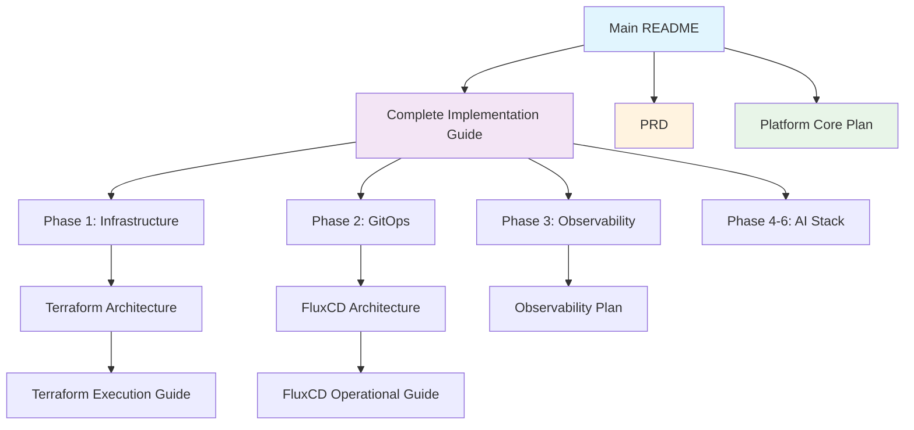

# Platform Core Documentation

Welcome to the Platform Core documentation! This guide helps you navigate through our comprehensive documentation to find exactly what you need.

## 📚 Documentation Overview

Our documentation is organized into several categories to help you find the right information quickly:

### 🚀 Getting Started
- **[Main README](../README.md)** - Project overview and quick start guide
- **[Complete Implementation Guide](./IMPLEMENTATION-GUIDE.md)** - **START HERE** - Comprehensive step-by-step deployment guide for all phases

### 📋 Project Planning & Architecture
- **[Product Requirements Document (PRD)](./PRD.md)** - Project overview, objectives, and requirements
- **[Platform Roadmap](./ROADMAP.md)** - Implementation phases, timeline, and success metrics
- **[Platform Core Plan](./platform-core-plan.md)** - Detailed architecture and implementation strategy

### 🏗️ Infrastructure & Deployment
- **[Phase 1: Core Infrastructure](./phase1-howto.md)** - Azure infrastructure deployment guide
- **[Terraform Architecture](./phase1-terraform-architecture.md)** - Infrastructure design and architecture
- **[Terraform Execution Guide](./phase1-terraform-execution-guide.md)** - Detailed deployment procedures

### 🔄 GitOps & Platform Services
- **[Phase 2: GitOps & Platform Bootstrap](./phase2-howto.md)** - FluxCD and core services deployment
- **[FluxCD Architecture](./phase2-fluxcd-architecture.md)** - GitOps architecture and design principles
- **[FluxCD Bootstrap Guide](./phase2-fluxcd-bootstrap-guide.md)** - Initial FluxCD setup procedures
- **[FluxCD Operational Guide](./phase2-fluxcd-operational-guide.md)** - Day-to-day GitOps operations

### 📊 Observability & Monitoring
- **[Phase 3: Centralized Observability](./phase3-howto.md)** - Multi-cluster monitoring deployment
- **[Week 3 Observability Plan](./WEEK3-OBSERVABILITY-PLAN.md)** - Detailed observability architecture and implementation

### 🔧 Migration & Maintenance
- **[GitLab to GitHub Migration](./GITLAB-TO-GITHUB-MIGRATION.md)** - Migration guide for Git provider changes

## 🎯 Quick Navigation by Use Case

### I'm new to Platform Core
1. Start with **[Main README](../README.md)** for project overview
2. Read **[PRD](./PRD.md)** to understand project goals
3. Review **[Platform Core Plan](./platform-core-plan.md)** for architecture details
4. Follow **[Complete Implementation Guide](./IMPLEMENTATION-GUIDE.md)** for deployment

### I want to deploy the platform
1. **Primary Guide**: **[Complete Implementation Guide](./IMPLEMENTATION-GUIDE.md)** - Covers all phases
2. **Phase-Specific Guides**:
   - **[Phase 1](./phase1-howto.md)** - Infrastructure
   - **[Phase 2](./phase2-howto.md)** - GitOps
   - **[Phase 3](./phase3-howto.md)** - Observability

### I need to understand the architecture
1. **[Platform Core Plan](./platform-core-plan.md)** - High-level architecture
2. **[Terraform Architecture](./phase1-terraform-architecture.md)** - Infrastructure design
3. **[FluxCD Architecture](./phase2-fluxcd-architecture.md)** - GitOps design
4. **[Week 3 Observability Plan](./WEEK3-OBSERVABILITY-PLAN.md)** - Observability design

### I'm operating the platform
1. **[FluxCD Operational Guide](./phase2-fluxcd-operational-guide.md)** - Day-to-day operations
2. **[Complete Implementation Guide](./IMPLEMENTATION-GUIDE.md)** - Troubleshooting section
3. **[Platform Roadmap](./ROADMAP.md)** - Maintenance and next steps

### I need to migrate or upgrade
1. **[GitLab to GitHub Migration](./GITLAB-TO-GITHUB-MIGRATION.md)** - Git provider migration
2. **[Complete Implementation Guide](./IMPLEMENTATION-GUIDE.md)** - Upgrade procedures

## 📖 Documentation Flow

## 🔍 Finding Specific Information

### Architecture & Design
- **Overall Architecture**: [Platform Core Plan](./platform-core-plan.md)
- **Infrastructure Design**: [Terraform Architecture](./phase1-terraform-architecture.md)
- **GitOps Design**: [FluxCD Architecture](./phase2-fluxcd-architecture.md)
- **Observability Design**: [Week 3 Observability Plan](./WEEK3-OBSERVABILITY-PLAN.md)

### Deployment & Implementation
- **Complete Deployment**: [Implementation Guide](./IMPLEMENTATION-GUIDE.md)
- **Infrastructure Only**: [Phase 1 How-To](./phase1-howto.md)
- **GitOps Setup**: [Phase 2 How-To](./phase2-howto.md)
- **Observability Setup**: [Phase 3 How-To](./phase3-howto.md)

### Operations & Maintenance
- **Daily Operations**: [FluxCD Operational Guide](./phase2-fluxcd-operational-guide.md)
- **Troubleshooting**: [Implementation Guide](./IMPLEMENTATION-GUIDE.md) - Troubleshooting section
- **Migration**: [GitLab to GitHub Migration](./GITLAB-TO-GITHUB-MIGRATION.md)

### Planning & Strategy
- **Project Goals**: [PRD](./PRD.md)
- **Implementation Timeline**: [Roadmap](./ROADMAP.md)
- **Technical Strategy**: [Platform Core Plan](./platform-core-plan.md)

## 📝 Documentation Standards

### Document Types
- **How-To Guides**: Step-by-step instructions for specific tasks
- **Architecture Documents**: Design and technical specifications
- **Reference Guides**: Detailed technical information
- **Planning Documents**: Project goals, timelines, and strategy

### Document Structure
Each document follows a consistent structure:
1. **Overview/Objective** - What the document covers
2. **Prerequisites** - What you need before starting
3. **Step-by-step instructions** - Detailed procedures
4. **Verification** - How to confirm success
5. **Troubleshooting** - Common issues and solutions
6. **Next Steps** - What to do after completion

### Contributing to Documentation
When updating documentation:
1. Follow the existing structure and style
2. Update this index if adding new documents
3. Ensure cross-references are accurate
4. Test all commands and procedures
5. Update the [CHANGELOG](../CHANGELOG.md) with documentation changes

## 🆘 Getting Help

If you can't find what you're looking for:

1. **Check the [Complete Implementation Guide](./IMPLEMENTATION-GUIDE.md)** - It covers most common scenarios
2. **Review the troubleshooting sections** in each guide
3. **Check the [Main README](../README.md)** for quick start information
4. **Report documentation issues** in the GitHub issue tracker
5. **Ask for help** in the platform team Slack channel

---

**Happy deploying! 🚀** 