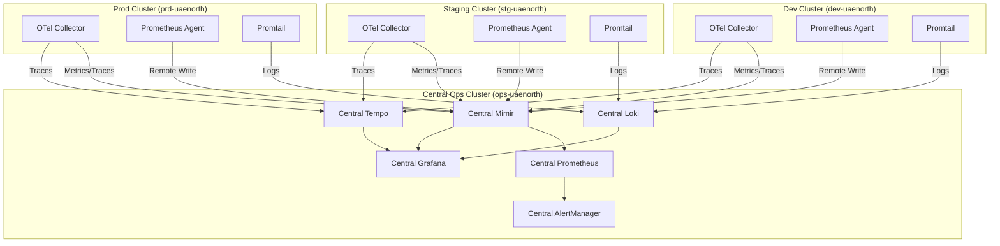

# 📊 Week 3: Centralized Multi-Cluster Observability Stack

## Overview

Deploy a **centralized, multi-cluster observability architecture** using LGTM (Loki, Grafana, Tempo, Mimir) + Prometheus stack with full OpenTelemetry integration. This creates a single **Central Operations Center** where SRE teams can monitor and compare metrics across all clusters, environments, and regions in unified dashboards.

---

## 🎯 Objectives

- Deploy **centralized LGTM + Prometheus observability stack** in a dedicated management cluster
- Enable **lightweight collection agents** on all workload clusters (dev, stg, prd)
- Provide **unified dashboards** comparing infrastructure, applications, and AI/ML workloads across clusters
- Establish **cluster-aware alerting** with proper environment and region context
- Support **multi-environment, multi-region observability** with single pane of glass view

---

## 🏗️ Centralized Architecture Overview

### 🎯 Central Operations Cluster (Management/Ops Cluster)
**Location**: `ops-uaenorth` (dedicated management cluster)

**Components**:
- **Full LGTM Stack**: Loki, Grafana, Tempo, Mimir (centralized storage & visualization)
- **Central Prometheus**: Federation endpoint collecting from all clusters
- **AlertManager**: Centralized alerting with cluster context
- **Grafana**: Multi-cluster dashboards and unified visualization

### 🔄 Workload Clusters (dev, stg, prd)
**Locations**: `dev-uaenorth`, `stg-uaenorth`, `prd-uaenorth`

**Components**:
- **OpenTelemetry Collectors**: Lightweight agents forwarding to central stack
- **Prometheus Agents**: Scraping local metrics, remote write to central Mimir
- **Promtail**: Log collection forwarding to central Loki
- **Local Service Discovery**: Auto-discovery of local services and pods

### 🌍 Data Flow Architecture



---

## 📦 Component Breakdown

### 🏢 Central Operations Cluster Components

#### 1. Central Grafana Mimir
```yaml
Components:
  - Distributor (HA, multi-tenant)
  - Ingester (with cluster labeling)
  - Querier (cross-cluster query support)
  - Query Frontend
  - Compactor
  - Store Gateway
Storage:
  - Azure Blob Storage (multi-region replication)
  - Redis Cluster (for caching)
Multi-Tenancy:
  - Tenant per environment: dev, stg, prd
  - Cross-tenant queries for comparison views
```

#### 2. Central Loki Stack
```yaml
Components:
  - Loki Gateway (multi-tenant routing)
  - Loki Distributor (with cluster context)
  - Loki Ingester
  - Loki Querier (cross-cluster log aggregation)
  - Loki Compactor
Storage:
  - Azure Blob Storage for log chunks
  - Cluster and environment labeling
Multi-Tenancy:
  - Tenant isolation by environment
  - Cluster identification in log streams
```

#### 3. Central Tempo
```yaml
Components:
  - Tempo Distributor (cluster-aware)
  - Tempo Ingester
  - Tempo Querier (cross-cluster trace correlation)
  - Tempo Compactor
Storage:
  - Azure Blob Storage for trace data
  - Cluster context in trace metadata
```

#### 4. Central Grafana
```yaml
Components:
  - Grafana Server (HA mode)
  - Multi-cluster dashboards
  - Environment comparison views
  - Alert rules with cluster context
Data Sources:
  - Central Mimir (all clusters)
  - Central Loki (all clusters)
  - Central Tempo (all clusters)
  - Central Prometheus (federation)
```

### 🔧 Workload Cluster Components

#### 1. OpenTelemetry Collectors (Per Cluster)
```yaml
Mode: Agent + Gateway
Configuration:
  - Cluster identification labels
  - Environment context injection
  - Central endpoints configuration
  - Batch processing and retry logic
Data Pipeline:
  - Local collection → Processing → Central export
```

#### 2. Prometheus Agents (Per Cluster)
```yaml
Configuration:
  - Local scraping only
  - Remote write to central Mimir
  - Cluster and environment labels
  - Minimal local storage (15min)
Service Discovery:
  - Kubernetes pods and services
  - Custom service monitors
```

#### 3. Promtail Agents (Per Cluster)
```yaml
Configuration:
  - DaemonSet deployment
  - Cluster and environment labeling
  - Central Loki endpoint
  - Log parsing and enrichment
```

---

## 🔖 Cluster Identification Strategy

### Automatic Label Injection
Every metric, log, and trace will include:

```yaml
Labels:
  cluster: "dev-uaenorth" | "stg-uaenorth" | "prd-uaenorth"
  environment: "dev" | "stg" | "prd"
  region: "uaenorth"
  cluster_type: "workload" | "ops"
  tenant_id: "platform-core"
```

### OpenTelemetry Collector Configuration
```yaml
# Workload cluster collector config
processors:
  resource:
    attributes:
      - key: cluster
        value: ${CLUSTER_NAME}
        action: upsert
      - key: environment
        value: ${ENVIRONMENT}
        action: upsert
      - key: region
        value: ${REGION}
        action: upsert
  
exporters:
  prometheusremotewrite:
    endpoint: https://mimir.ops-uaenorth.internal/api/v1/push
    headers:
      X-Scope-OrgID: ${ENVIRONMENT}
  loki:
    endpoint: https://loki.ops-uaenorth.internal/loki/api/v1/push
    tenant_id: ${ENVIRONMENT}
  tempo:
    endpoint: tempo.ops-uaenorth.internal:4317
    headers:
      tenant: ${ENVIRONMENT}
```

### Prometheus Agent Configuration
```yaml
# Remote write configuration per cluster
remote_write:
  - url: https://mimir.ops-uaenorth.internal/api/v1/push
    headers:
      X-Scope-OrgID: dev  # stg, prd
    write_relabel_configs:
      - source_labels: [__name__]
        target_label: cluster
        replacement: dev-uaenorth
      - source_labels: [__name__]
        target_label: environment
        replacement: dev
```

---

## 🚀 Revised Implementation Phases

### Phase 3.1: Central Infrastructure Setup (Days 1-3)
**Objectives**: Deploy central operations cluster and storage backends

**Tasks**:
1. **Central Ops Cluster Setup**
   - Deploy dedicated `ops-uaenorth` AKS cluster
   - Configure internal DNS and networking
   - Setup private endpoints for central services

2. **Central Storage Setup**
   - Create storage accounts for centralized Mimir, Loki, and Tempo
   - Configure multi-region blob storage with replication
   - Setup access keys and connection strings in Key Vault

3. **Network Connectivity**
   - Configure VNet peering between ops and workload clusters
   - Setup internal load balancers for central services
   - Configure DNS resolution for central endpoints

**Deliverables**:
- Central ops cluster deployment
- Storage backend configuration
- Network connectivity setup

### Phase 3.2: Central LGTM Stack Deployment (Days 4-6)
**Objectives**: Deploy centralized observability stack

**Tasks**:
1. **Central Mimir Deployment**
   - Deploy Mimir with multi-tenant configuration
   - Configure environment-based tenant isolation
   - Setup cross-tenant query capabilities

2. **Central Loki Deployment**
   - Deploy Loki with multi-tenant log aggregation
   - Configure tenant routing and isolation
   - Setup log retention policies per environment

3. **Central Tempo Deployment**
   - Deploy Tempo with cluster-aware trace collection
   - Configure trace correlation across clusters
   - Setup trace retention and sampling policies

**Deliverables**:
- Central LGTM stack deployment
- Multi-tenancy configuration
- Cross-cluster data ingestion endpoints

### Phase 3.3: Workload Cluster Agents Deployment (Days 7-8)
**Objectives**: Deploy lightweight collection agents on all workload clusters

**Tasks**:
1. **OpenTelemetry Agents**
   - Deploy OTel Operator on each workload cluster
   - Configure collectors with cluster identification
   - Setup pipelines to central endpoints

2. **Prometheus Agents**
   - Deploy Prometheus in agent mode per cluster
   - Configure remote write to central Mimir
   - Setup local service discovery

3. **Promtail Agents**
   - Deploy Promtail DaemonSets per cluster
   - Configure log forwarding to central Loki
   - Setup cluster-specific log parsing

**Deliverables**:
- Multi-cluster agent deployment
- Data flow validation
- Cluster identification verification

### Phase 3.4: Central Grafana & Multi-Cluster Dashboards (Days 9-10)
**Objectives**: Deploy central Grafana with multi-cluster visualization

**Tasks**:
1. **Central Grafana Setup**
   - Deploy Grafana with multi-tenant data sources
   - Configure authentication and authorization
   - Setup team-based access control

2. **Multi-Cluster Dashboards**
   - Create cluster comparison dashboards
   - Build environment overview dashboards
   - Setup cross-cluster correlation views
   - Import and customize community dashboards

3. **Alerting Configuration**
   - Configure AlertManager with cluster context
   - Create environment-specific alert rules
   - Setup notification routing per team/environment

**Deliverables**:
- Central Grafana deployment
- Multi-cluster dashboard library
- Centralized alerting system

---

## 📁 Revised Directory Structure

```
terraform/
├── modules/
│   ├── observability-central/     # Central ops cluster components
│   │   ├── main.tf
│   │   ├── variables.tf
│   │   ├── mimir.tf
│   │   ├── loki.tf
│   │   ├── tempo.tf
│   │   ├── grafana.tf
│   │   └── storage.tf
│   └── observability-agent/       # Workload cluster agents
│       ├── main.tf
│       ├── variables.tf
│       ├── prometheus-agent.tf
│       ├── otel-collector.tf
│       └── promtail.tf
└── envs/
    ├── ops-uaenorth/
    │   └── observability-central.tf
    ├── dev-uaenorth/
    │   └── observability-agent.tf
    ├── stg-uaenorth/
    │   └── observability-agent.tf
    └── prd-uaenorth/
        └── observability-agent.tf

flux-config/
├── clusters/
│   ├── platform-core-ops-aks/     # Central ops cluster
│   │   └── infrastructure/
│   │       └── observability/
│   │           ├── mimir/
│   │           ├── loki/
│   │           ├── tempo/
│   │           ├── grafana/
│   │           │   └── dashboards/
│   │           │       ├── multi-cluster-overview.json
│   │           │       ├── environment-comparison.json
│   │           │       ├── cross-cluster-applications.json
│   │           │       └── gpu-monitoring-all-clusters.json
│   │           └── alertmanager/
│   ├── platform-core-dev-aks/     # Dev workload cluster
│   │   └── infrastructure/
│   │       └── observability/
│   │           ├── opentelemetry/
│   │           ├── prometheus-agent/
│   │           └── promtail/
│   ├── platform-core-stg-aks/     # Staging workload cluster
│   │   └── infrastructure/
│   │       └── observability/
│   └── platform-core-prd-aks/     # Production workload cluster
│       └── infrastructure/
│           └── observability/
```

---

## 🎨 Multi-Cluster Grafana Dashboards

### 1. Multi-Cluster Overview Dashboard
```yaml
Features:
  - Cluster health matrix (dev/stg/prd)
  - Resource utilization comparison
  - Alert summary per environment
  - Cost breakdown by cluster
Queries:
  - sum by (cluster) (up{job="kubernetes-nodes"})
  - avg by (cluster) (node_memory_MemAvailable_bytes)
  - count by (cluster, severity) (ALERTS)
```

### 2. Environment Comparison Dashboard
```yaml
Features:
  - Side-by-side environment metrics
  - Application performance comparison
  - Infrastructure drift detection
  - Capacity planning insights
Queries:
  - avg_over_time(cpu_usage[1h]) by cluster, environment
  - histogram_quantile(0.95, request_duration) by cluster
```

### 3. Cross-Cluster Application Performance
```yaml
Features:
  - Service mesh view across clusters
  - Request flow between environments
  - Error rate comparison
  - Latency percentiles by cluster
Queries:
  - rate(http_requests_total[5m]) by cluster, service
  - histogram_quantile(0.99, http_request_duration) by cluster
```

### 4. GPU Monitoring - All Clusters
```yaml
Features:
  - GPU utilization across all clusters
  - Model inference comparison
  - GPU cost analysis per environment
  - Performance benchmarking
Queries:
  - nvidia_gpu_utilization_gpu by cluster, environment
  - avg(model_inference_duration) by cluster, model
```

---

## 🔧 Key Multi-Cluster Configurations

### Central Mimir Configuration
```yaml
# Multi-tenant configuration
multitenancy_enabled: true
limits:
  ingestion_tenant_shard_size: 0  # Allow cross-tenant queries

# Query frontend configuration for cross-cluster queries
query_frontend:
  align_queries_with_step: true
  split_queries_by_interval: 24h
  cache_results: true

# Ruler for cross-cluster alerting
ruler:
  enable_api: true
  rule_path: /data/ruler
  tenant_federation:
    enabled: true
```

### Central Grafana Multi-Tenant Data Sources
```yaml
apiVersion: v1
kind: ConfigMap
metadata:
  name: grafana-datasources
data:
  datasources.yaml: |
    apiVersion: 1
    datasources:
      # Per-environment data sources
      - name: Mimir-Dev
        type: prometheus
        url: http://mimir-query-frontend:8080/prometheus
        access: proxy
        jsonData:
          httpHeaderName1: X-Scope-OrgID
        secureJsonData:
          httpHeaderValue1: dev
      
      - name: Mimir-Staging
        type: prometheus
        url: http://mimir-query-frontend:8080/prometheus
        access: proxy
        jsonData:
          httpHeaderName1: X-Scope-OrgID
        secureJsonData:
          httpHeaderValue1: stg
      
      - name: Mimir-Production
        type: prometheus
        url: http://mimir-query-frontend:8080/prometheus
        access: proxy
        jsonData:
          httpHeaderName1: X-Scope-OrgID
        secureJsonData:
          httpHeaderValue1: prd
      
      # Cross-tenant data source for comparison views
      - name: Mimir-All-Environments
        type: prometheus
        url: http://mimir-query-frontend:8080/prometheus
        access: proxy
        jsonData:
          httpHeaderName1: X-Scope-OrgID
        secureJsonData:
          httpHeaderValue1: dev|stg|prd  # Federation query
```

### OpenTelemetry Collector - Workload Cluster
```yaml
# Environment-specific collector configuration
apiVersion: opentelemetry.io/v1alpha1
kind: OpenTelemetryCollector
metadata:
  name: cluster-collector
spec:
  config: |
    receivers:
      otlp:
        protocols:
          grpc:
            endpoint: 0.0.0.0:4317
      prometheus:
        config:
          scrape_configs:
            - job_name: 'kubernetes-pods'
              kubernetes_sd_configs:
                - role: pod
    
    processors:
      batch:
        timeout: 1s
        send_batch_size: 1024
      resource:
        attributes:
          - key: cluster
            value: "${CLUSTER_NAME}"
            action: upsert
          - key: environment
            value: "${ENVIRONMENT}"
            action: upsert
          - key: region
            value: "${REGION}"
            action: upsert
    
    exporters:
      prometheusremotewrite:
        endpoint: https://mimir.ops-uaenorth.internal/api/v1/push
        headers:
          X-Scope-OrgID: "${ENVIRONMENT}"
        sending_queue:
          enabled: true
          num_consumers: 5
          queue_size: 1000
        retry_on_failure:
          enabled: true
          initial_interval: 5s
          max_interval: 30s
          max_elapsed_time: 300s
      
      loki:
        endpoint: https://loki.ops-uaenorth.internal/loki/api/v1/push
        tenant_id: "${ENVIRONMENT}"
        
      tempo:
        endpoint: tempo.ops-uaenorth.internal:4317
        headers:
          tenant: "${ENVIRONMENT}"
    
    service:
      pipelines:
        metrics:
          receivers: [otlp, prometheus]
          processors: [batch, resource]
          exporters: [prometheusremotewrite]
        logs:
          receivers: [otlp]
          processors: [batch, resource]
          exporters: [loki]
        traces:
          receivers: [otlp]
          processors: [batch, resource]
          exporters: [tempo]
```

---

## 🚨 Multi-Cluster Alerting Strategy

### Environment-Aware Alert Rules
```yaml
groups:
  - name: multi-cluster-infrastructure
    rules:
      # Alert when any cluster in any environment is down
      - alert: ClusterDown
        expr: up{job="kubernetes-apiservers"} == 0
        for: 5m
        labels:
          severity: critical
        annotations:
          summary: "Cluster {{ $labels.cluster }} in {{ $labels.environment }} is down"
          description: "The Kubernetes API server for cluster {{ $labels.cluster }} in environment {{ $labels.environment }} has been unreachable for more than 5 minutes."
      
      # Cross-environment comparison alerts
      - alert: EnvironmentDrift
        expr: |
          abs(
            avg by (cluster) (node_memory_MemAvailable_bytes{environment="prd"}) -
            avg by (cluster) (node_memory_MemAvailable_bytes{environment="stg"})
          ) > 1e9
        for: 15m
        labels:
          severity: warning
        annotations:
          summary: "Memory usage drift detected between staging and production"
      
      # GPU utilization across all clusters
      - alert: MultiClusterGPUHigh
        expr: nvidia_gpu_utilization_gpu > 90
        for: 10m
        labels:
          severity: warning
        annotations:
          summary: "High GPU utilization in cluster {{ $labels.cluster }}"
          description: "GPU utilization is {{ $value }}% in cluster {{ $labels.cluster }} environment {{ $labels.environment }}"
```

### AlertManager Routing Configuration
```yaml
route:
  group_by: ['cluster', 'environment', 'alertname']
  group_wait: 10s
  group_interval: 10s
  repeat_interval: 1h
  receiver: 'default'
  routes:
    - match:
        environment: prd
      receiver: 'production-alerts'
      routes:
        - match:
            severity: critical
          receiver: 'production-critical'
    
    - match:
        environment: stg
      receiver: 'staging-alerts'
    
    - match:
        environment: dev
      receiver: 'development-alerts'

receivers:
  - name: 'production-critical'
    slack_configs:
      - api_url: '{{ .SlackWebhookURL }}'
        channel: '#prod-alerts'
        title: 'CRITICAL: {{ .GroupLabels.cluster }} - {{ .GroupLabels.alertname }}'
        text: '{{ range .Alerts }}{{ .Annotations.description }}{{ end }}'
```

---

## 📊 Central Operations Dashboards

### SRE Operations Center Dashboard
```yaml
Dashboard Features:
  - Real-time cluster status matrix
  - Environment health score
  - Cross-cluster resource utilization
  - Alert summary with drill-down
  - Cost analysis and optimization
  - GPU farm utilization
  - Application performance SLIs

Panels:
  1. Cluster Status Grid (green/yellow/red per cluster)
  2. Environment Comparison Chart
  3. Alert Heatmap (cluster vs severity)
  4. Resource Usage Timeline (all clusters)
  5. Top Resource Consumers (cross-cluster)
  6. GPU Utilization Matrix
  7. Application Error Rates (all environments)
  8. Network Traffic Between Clusters
```

---

## 🔐 Security & Access Control

### Multi-Cluster RBAC
```yaml
# SRE team - full access to central ops cluster
apiVersion: rbac.authorization.k8s.io/v1
kind: ClusterRole
metadata:
  name: sre-observability-admin
rules:
  - apiGroups: [""]
    resources: ["*"]
    verbs: ["*"]
  - apiGroups: ["monitoring.coreos.com"]
    resources: ["*"]
    verbs: ["*"]

---
# Development team - read-only access to dev environment data
apiVersion: rbac.authorization.k8s.io/v1
kind: Role
metadata:
  name: dev-observability-viewer
  namespace: grafana
rules:
  - apiGroups: [""]
    resources: ["configmaps"]
    resourceNames: ["dev-dashboards"]
    verbs: ["get", "list"]
```

### Grafana Role-Based Access
```yaml
# Grafana team configuration
teams:
  - name: "SRE Team"
    permissions:
      - action: "dashboards:read"
        scope: "dashboards:*"
      - action: "datasources:query"
        scope: "datasources:*"
  
  - name: "Dev Team"
    permissions:
      - action: "dashboards:read"
        scope: "dashboards:uid:dev-*"
      - action: "datasources:query"
        scope: "datasources:name:Mimir-Dev"
```

---

## 📈 Success Metrics

### Technical Metrics
- **Cross-Cluster Data Ingestion**: >99.9% successful metric ingestion from all clusters
- **Dashboard Load Performance**: <3s for multi-cluster dashboards
- **Alert Correlation**: <5s for cross-cluster alert correlation
- **Data Consistency**: <30s propagation delay between clusters
- **Query Performance**: <5s for cross-environment comparison queries

### Operational Metrics
- **MTTR Improvement**: Faster incident resolution with cluster context
- **Alert Accuracy**: Reduced false positives with environment correlation
- **Team Efficiency**: SRE team can monitor all environments from single interface
- **Cost Optimization**: Identify resource waste across clusters
- **Compliance**: Centralized audit trail for all environments

---

## 🛠️ Validation & Testing

### Multi-Cluster Testing Checklist
- [ ] Metrics from all clusters visible in central Grafana
- [ ] Logs searchable across all environments with cluster context
- [ ] Traces correlated between clusters and services
- [ ] Alerts fired with proper cluster and environment labels
- [ ] Dashboard variables switch between clusters correctly
- [ ] Cross-cluster queries work for comparison views
- [ ] Data isolation between environments maintained
- [ ] Failover scenarios tested (central stack outage)

---

## 🔄 Next Steps (Week 4)

1. **Advanced Multi-Cluster Features**
   - Predictive scaling based on cross-environment patterns
   - Automated capacity planning using historical data
   - Cross-cluster service dependency mapping

2. **AI/ML Specific Multi-Cluster Observability**
   - Model performance comparison across environments
   - A/B testing metrics with environment correlation
   - GPU utilization optimization across clusters

3. **Advanced Operations Center**
   - Incident management integration
   - Automated runbook execution
   - Chaos engineering observability

---

This revised architecture gives you a **true Central Operations Center** where your SRE team can monitor all clusters from a single Grafana instance, compare environments side-by-side, and get unified alerting with proper cluster context! 🚀 