```mermaid
graph TD
    subgraph Terraform_Configuration_envs_dev_uaenorth
        direction LR
        TF_VARS["terraform.tfvars\n(Project, Env, Location, Tags)"]
        BACKEND_HCL["backend.hcl\n(TF State RG: rg-tfstate-dev-001)"]
        MAIN_TF_ENV["main.tf\n(Module Calls)"]
    end

    subgraph Network_Module_rg_network_dev_uaenorth_001
        direction LR
        RG_NET["azurerm_resource_group.rg\nrg-network-dev-uaenorth-001"]
        VNET["azurerm_virtual_network.vnet"]
        SUB_AKS["azurerm_subnet.aks\n(aks-subnet)"]
        SUB_ACR["azurerm_subnet.acr\n(acr-subnet)"]
        SUB_KV["azurerm_subnet.keyvault\n(keyvault-subnet)"]
        NSG["azurerm_network_security_group.nsg"]

        RG_NET --> VNET
        VNET --> SUB_AKS
        VNET --> SUB_ACR
        VNET --> SUB_KV
        NSG --> SUB_AKS
        NSG --> SUB_ACR
        NSG --> SUB_KV
    end

    subgraph AKS_Module_rg_aks_dev_uaenorth_001
        direction LR
        RG_AKS["azurerm_resource_group.rg\nrg-aks-dev-uaenorth-001"]
        AKS_CLUSTER["azurerm_kubernetes_cluster.aks"]
        AKS_SYS_POOL["Default Node Pool\n(System)"]
        AKS_USER_POOL["azurerm_kubernetes_cluster_node_pool.user\n(GPU)"]
        LOG_ANALYTICS["azurerm_log_analytics_workspace.workspace"]
        AKS_KUBELET_IDENTITY["AKS Kubelet Identity\n(SystemAssigned)"]

        RG_AKS --> AKS_CLUSTER
        RG_AKS --> LOG_ANALYTICS
        AKS_CLUSTER --> AKS_SYS_POOL
        AKS_CLUSTER --> AKS_USER_POOL
        AKS_CLUSTER --> AKS_KUBELET_IDENTITY
        AKS_CLUSTER -- "oms_agent" --> LOG_ANALYTICS
        AKS_CLUSTER -- "microsoft_defender" --> LOG_ANALYTICS
    end

    subgraph ACR_Module_rg_acr_dev_uaenorth_001
        direction LR
        RG_ACR["azurerm_resource_group.rg\nrg-acr-dev-uaenorth-001"]
        ACR_REG["azurerm_container_registry.acr"]
        ACR_PE["azurerm_private_endpoint.acr"]
        ACR_DNS_ZONE["azurerm_private_dns_zone.acr\n(privatelink.azurecr.io)"]
        ACR_DNS_LINK["azurerm_private_dns_zone_virtual_network_link.acr"]
        
        RG_ACR --> ACR_REG
        RG_ACR --> ACR_PE
        RG_ACR --> ACR_DNS_ZONE
        RG_ACR --> ACR_DNS_LINK
        ACR_PE --> ACR_REG
        ACR_DNS_ZONE --> ACR_DNS_LINK
    end

    subgraph KeyVault_Module_rg_keyvault_dev_uaenorth_001
        direction LR
        RG_KV["azurerm_resource_group.rg\nrg-aks-dev-uaenorth-001"]
        KV["azurerm_key_vault.kv"]
        KV_PE["azurerm_private_endpoint.kv"]
        KV_DNS_ZONE["azurerm_private_dns_zone.kv\n(privatelink.vaultcore.azure.net)"]
        KV_DNS_LINK["azurerm_private_dns_zone_virtual_network_link.kv"]
        KV_DIAG["azurerm_monitor_diagnostic_setting.kv"]

        RG_KV --> KV
        RG_KV --> KV_PE
        RG_KV --> KV_DNS_ZONE
        RG_KV --> KV_DNS_LINK
        KV_PE --> KV
        KV_DNS_ZONE --> KV_DNS_LINK
        KV --> KV_DIAG
    end

    %% Dependencies
    MAIN_TF_ENV --> Network_Module_Call["network module"]
    MAIN_TF_ENV --> AKS_Module_Call["aks module"]
    MAIN_TF_ENV --> ACR_Module_Call["acr module"]
    MAIN_TF_ENV --> KeyVault_Module_Call["keyvault module"]

    Network_Module_Call --> RG_NET
    AKS_Module_Call --> RG_AKS
    ACR_Module_Call --> RG_ACR
    KeyVault_Module_Call --> RG_KV

    %% Network to AKS
    SUB_AKS -->|subnet_id| AKS_CLUSTER
    SUB_AKS -->|vnet_subnet_id| AKS_SYS_POOL
    SUB_AKS -->|vnet_subnet_id| AKS_USER_POOL

    %% Network to ACR
    SUB_ACR -->|subnet_id| ACR_PE
    VNET -->|virtual_network_id| ACR_DNS_LINK

    %% Network to Key Vault
    SUB_KV -->|subnet_id| KV_PE
    VNET -->|virtual_network_id| KV_DNS_LINK

    %% AKS to Key Vault
    AKS_KUBELET_IDENTITY -->|principal_id - Role Assignment| KV
    KV -->|keyvault_id| AKS_CLUSTER
    LOG_ANALYTICS -->|log_analytics_workspace_id| KV_DIAG

    %% AKS to ACR
    AKS_KUBELET_IDENTITY -->|principal_id - Role Assignment for AcrPull| ACR_REG

    classDef tfModule fill:#E6F0FA,stroke:#B3D9FF,stroke-width:2px,color:#333;
    classDef azureRG fill:#FFF2CC,stroke:#FFD966,stroke-width:2px,color:#333;
    classDef azureService fill:#E9FCE9,stroke:#AEEBAE,stroke-width:2px,color:#333;
    classDef tfConfig fill:#F0F0F0,stroke:#CCCCCC,stroke-width:2px,color:#333;

    class TF_VARS,BACKEND_HCL,MAIN_TF_ENV tfConfig;
    class RG_NET,RG_AKS,RG_ACR,RG_KV azureRG;
    class VNET,SUB_AKS,SUB_ACR,SUB_KV,NSG,AKS_CLUSTER,AKS_SYS_POOL,AKS_USER_POOL,LOG_ANALYTICS,AKS_KUBELET_IDENTITY,ACR_REG,ACR_PE,ACR_DNS_ZONE,ACR_DNS_LINK,KV,KV_PE,KV_DNS_ZONE,KV_DNS_LINK,KV_DIAG azureService;
    
    class Network_Module_Call,AKS_Module_Call,ACR_Module_Call,KeyVault_Module_Call tfModule

    %% Styling for subgraphs (Note: This may not render in all environments)
    classDef subgraphStyle fill:#f9f9f9,stroke:#ddd,stroke-width:1px,rx:5,ry:5

```

This diagram provides an overview of:
-   Your main Terraform configuration files in `envs/dev-uaenorth`.
-   Each of the primary modules (Network, AKS, ACR, Key Vault).
-   The dedicated resource group created by each module (e.g., `rg-network-dev-uaenorth-001`).
-   Key Azure resources within each module (e.g., VNet, AKS Cluster, ACR Registry, Key Vault).
-   Important connections and dependencies, such as:
    -   AKS using the network subnet.
    -   Private endpoints for ACR and Key Vault connecting to their respective services and subnets.
    -   Private DNS zones linked to the VNet for private endpoint resolution.
    -   Role assignments for AKS identity to access Key Vault and ACR.
    -   Log Analytics integration for AKS and Key Vault diagnostics.

You can copy the Mermaid code block above and paste it into a Mermaid-compatible viewer (like the Mermaid Live Editor, or integrated previews in some Markdown editors/IDEs) to visualize the diagram. 